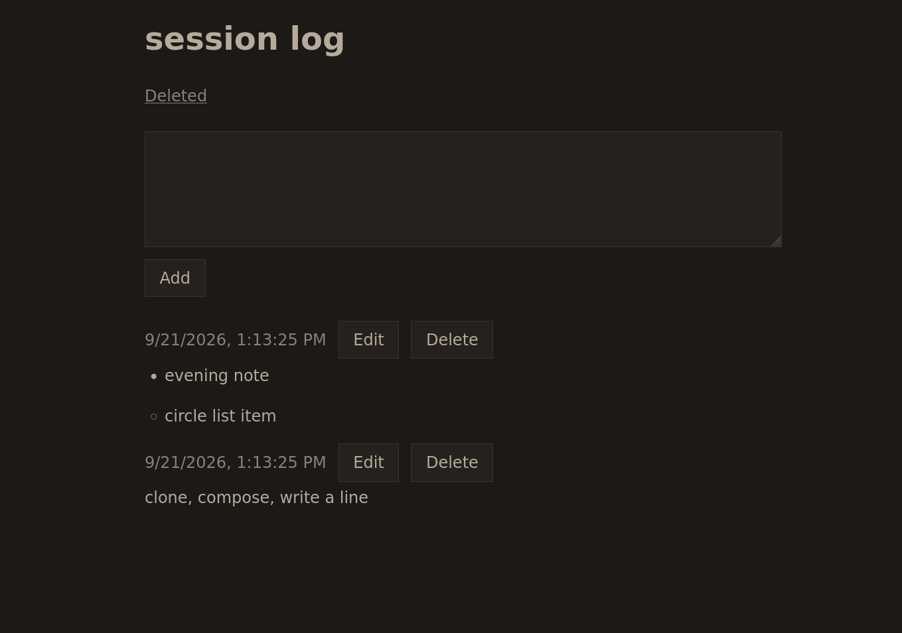

# session log

Personal session log. One page: write a line, see recent entries.

```bash
git clone https://github.com/KoalaLoveTree/session-log.git
cd session-log
```



## Run

Live (your log):

```bash
cp .env.example .env
docker compose up --build
```

Open `http://localhost:3000`. On a phone on the same Wi‑Fi: `http://<lan-ip>:3000` (on the PC, `hostname -I`).

Test (other data, same code):

```bash
cp .env.test.example .env.test
docker compose --env-file .env.test up --build
```

Open `http://localhost:3001`. Both can run at once.

## Rust

```bash
cd api
cargo fmt
cargo clippy -- -D warnings
DATABASE_URL=postgres://lr:lr@127.0.0.1:5433/lr cargo test
```

`cargo test` needs the test stack (`docker compose --env-file .env.test up --build`) so Postgres is on `127.0.0.1:5433`. Tests create their own databases; they do not write your log.

## Docs

- `SPEC.md` — v1 (page, table, two routes, compose)
- `TICKETS.md` — work queue
- [http://localhost:3000/api/docs](http://localhost:3000/api/docs) — API (Swagger)

GitHub Actions (`ci`) runs fmt, clippy, `cargo test`, and `cargo build` on push.
